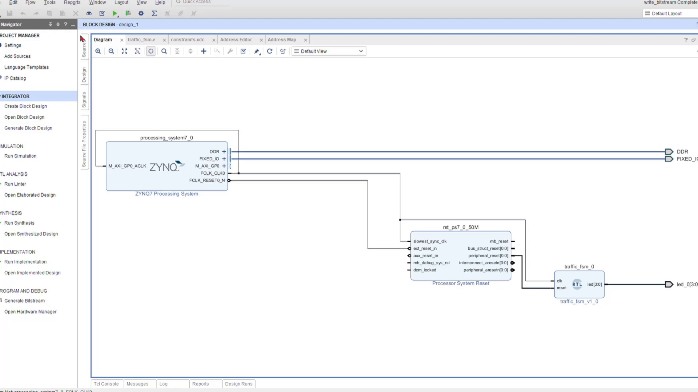
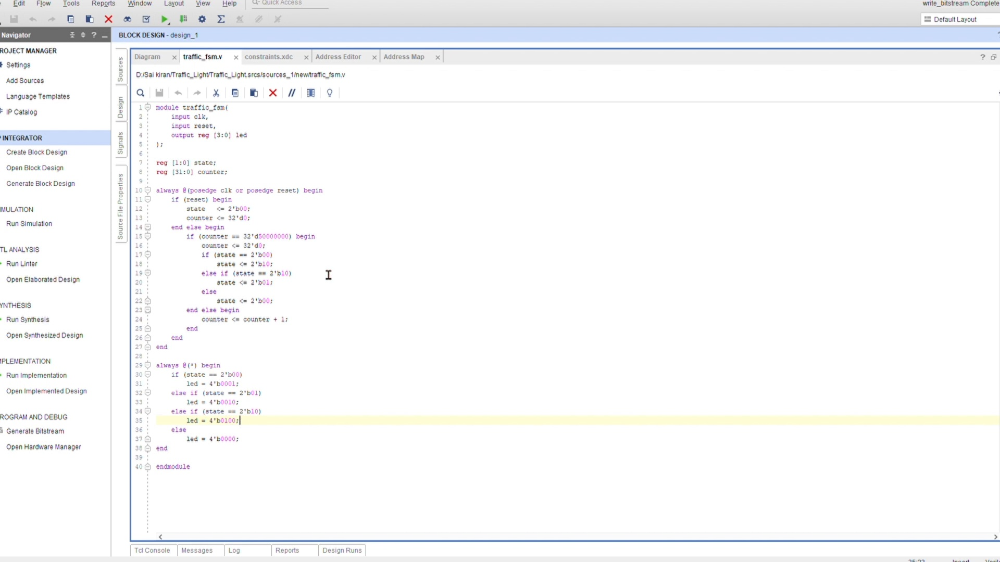
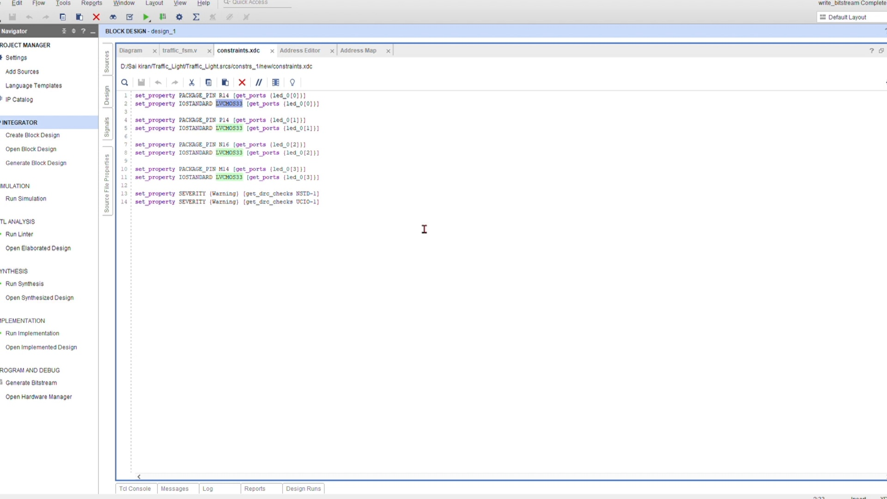
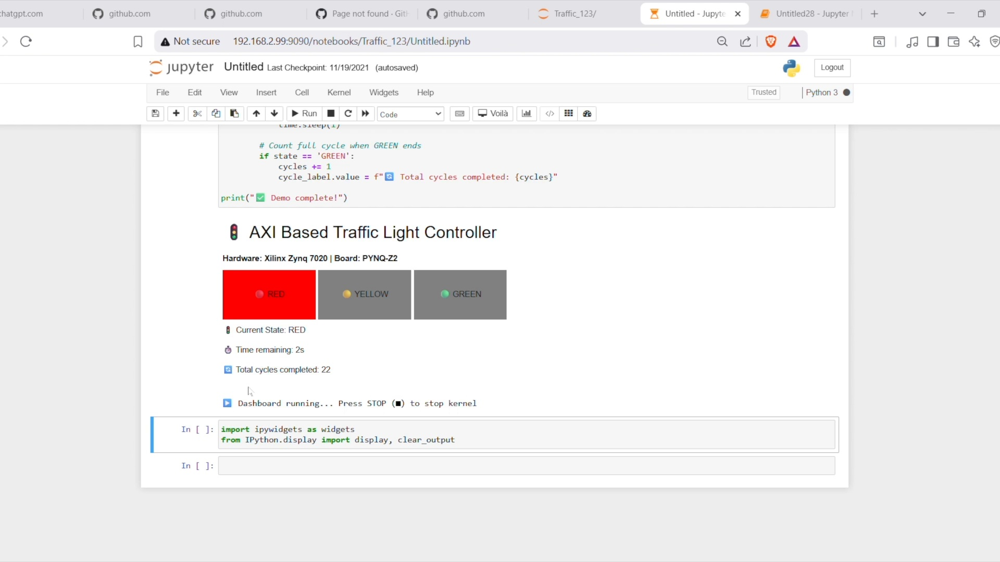

# 🚦 FPGA Traffic Light Controller

> Configurable AXI-Based Design on PYNQ-Z2 Board

A hardware traffic light controller implemented as a Moore FSM in Verilog, synthesized via Vivado, and loaded onto the PYNQ-Z2 FPGA board using a Python overlay. Includes a live ipywidgets dashboard for real-time state visualization.

**Author:** G Sai Kiran | S20220020274  
**Institution:** IIIT Sri City | B.Tech ECE

---

## Demo

📹 [Project Video](https://drive.google.com/file/d/1KSdQUXRiqOF3andtruOAUe6CUvB68Ly1/view?usp=sharing) &nbsp;|&nbsp; 📄 [Final Report](SoC_Final.pdf)

---

## Screenshots

### Vivado Block Design — ZYNQ PS + Processor System Reset + traffic_fsm RTL


### Verilog FSM Source Code


### XDC Constraints — Pin Mapping


### Jupyter Dashboard — Live State Visualization on PYNQ


---

## Tech Stack

| Layer | Tools / Technologies |
|---|---|
| Hardware Design | Vivado Block Design, ZYNQ7 PS |
| RTL | Verilog FSM (`traffic_fsm.v`) |
| Constraints | XDC (`constraints.xdc`) |
| Board | PYNQ-Z2 (Zynq-7020) |
| Software | Python, PYNQ Overlay, Jupyter Notebook |
| Visualization | ipywidgets Dashboard |

---

## System Architecture

```
ZYNQ7 PS
  └── FCLK_CLK0 (50 MHz) ──→ traffic_fsm (Verilog RTL)
  └── FCLK_RESET0_N ──→ Processor System Reset ──→ traffic_fsm reset
                                                        └── led[3:0] ──→ LD0/LD1/LD2/LD3
```

---

## Verilog FSM Design

**Moore Machine — 3 States — 50 Million Clock Cycles Per State**

```
RED (led = 4'b0001) → YELLOW (led = 4'b0010) → GREEN (led = 4'b0100) → (repeat)
```

| State | LED Output | Duration |
|---|---|---|
| RED | `4'b0001` | 50M cycles (~1 sec @ 50MHz) |
| YELLOW | `4'b0010` | 50M cycles |
| GREEN | `4'b0100` | 50M cycles |

---

## XDC Pin Mapping

| Signal | FPGA Pin | Onboard LED | Standard |
|---|---|---|---|
| led_0[0] | R14 | LD0 | LVCMOS33 |
| led_0[1] | P14 | LD1 | LVCMOS33 |
| led_0[2] | N16 | LD2 | LVCMOS33 |
| led_0[3] | M14 | LD3 | LVCMOS33 |

---

## Running on PYNQ-Z2

```python
from pynq import Overlay

# Load bitstream onto FPGA
ol = Overlay("design_1.bit")

# FSM starts automatically — LEDs begin cycling RED → YELLOW → GREEN
```

Open `traffic_light_dashboard.ipynb` in Jupyter on the PYNQ board for the live dashboard.

---

## End-to-End Workflow

```
1. Block Design   →   ZYNQ PS + Reset + traffic_fsm RTL
2. Verilog FSM    →   Moore machine 3-state loop
3. XDC Pin Map    →   LED outputs → physical pins (LVCMOS33)
4. Bitstream Gen  →   Vivado synthesis & implementation
5. PYNQ Overlay   →   Python loads bitstream onto FPGA
6. Dashboard      →   ipywidgets visualizes state in Jupyter
```

---

## Challenges & Fixes

| Challenge | Fix Applied |
|---|---|
| Custom IP via Vitis threw `AttributeError` | Switched to direct RTL module in Block Design |
| DRC errors — unspecified I/O standard | Added LVCMOS33 to all output pins in XDC |
| FCLK_CLK0 not connected to FSM | Used Tcl Console to explicitly wire clock |
| AXI SmartConnect IP outdated | Removed unnecessary AXI IP blocks |
| FSM stuck on RED permanently | Fixed counter increment placement in else block |

---

## Repository Structure

```
FPGA-Traffic-Light-Controller/
├── README.md
├── SoC_Final.pdf
├── traffic_fsm.v
├── constraints.xdc
├── Traffic_Light_Controller.ipynb
├── vivado_block_design.jpg
├── verilog_fsm_code.jpg
├── xdc_constraints.jpg
└── jupyter_dashboard.jpg
```

---

## License

MIT — see [LICENSE](LICENSE) for details.
